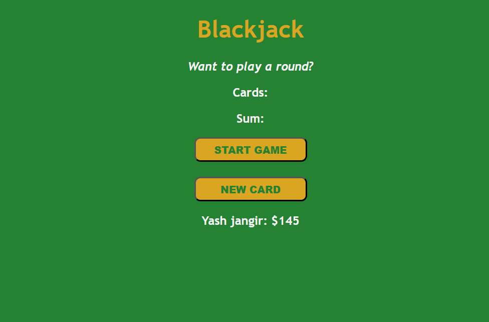

# 🃏 Blackjack Game

A simple Blackjack game built using **HTML**, **CSS**, and **JavaScript**. This project recreates the classic Blackjack card game where the objective is to reach **21** without going over.

## 📸 Screenshot

<p align="center">
  
</p>

---

## ✨ Features

- 🎲 Random card generation
- 🃏 Draw additional cards
- ✅ Blackjack (21) detection
- ❌ Game over when score exceeds 21
- 💰 Player name and chip balance display
- 🎨 Clean and responsive user interface

---

## 🛠️ Built With

- HTML5
- CSS3
- Vanilla JavaScript

---

## 📂 Project Structure

```text
Blackjack/
│
├── images/
│   └── screenshot.png
├── index.html
├── index.css
├── index.js
└── README.md
```

---

## 🚀 Getting Started

### Clone the repository

```bash
git clone https://github.com/yash1347/blackjack-game.git
```

### Open the project

```bash
cd blackjack-game
```

Open **index.html** in your browser or use **Live Server** in VS Code.

---

## 🎮 How to Play

1. Click **START GAME**.
2. Two random cards are dealt.
3. Your goal is to reach **21**.
4. Click **NEW CARD** to draw another card.
5. If:
   - Your sum is **less than 21**, you can continue.
   - Your sum is **exactly 21**, you win with Blackjack.
   - Your sum is **greater than 21**, you lose.

---

## 🎴 Card Values

| Card | Value |
|------|------:|
| Ace | 11 |
| 2–10 | Face Value |
| Jack | 10 |
| Queen | 10 |
| King | 10 |

---

## 📚 Concepts Practiced

- JavaScript Objects
- Arrays
- Loops
- Functions
- Conditional Statements
- DOM Manipulation
- Event Handling
- Random Number Generation

---

## 🔮 Future Improvements

- Add dealer AI
- Betting system
- Restart Game button
- Card images instead of numbers
- Sound effects
- Multiple players
- Leaderboard
- Better animations
- Mobile responsiveness

---

## 🤝 Contributing

Contributions are welcome!

1. Fork the repository
2. Create a feature branch

```bash
git checkout -b feature-name
```

3. Commit your changes

```bash
git commit -m "Add new feature"
```

4. Push your branch

```bash
git push origin feature-name
```

5. Open a Pull Request

---

## 📄 License

This project is licensed under the MIT License.

---

## 👨‍💻 Author

**Yash Jangir**

If you liked this project, consider giving it a ⭐ on GitHub!
